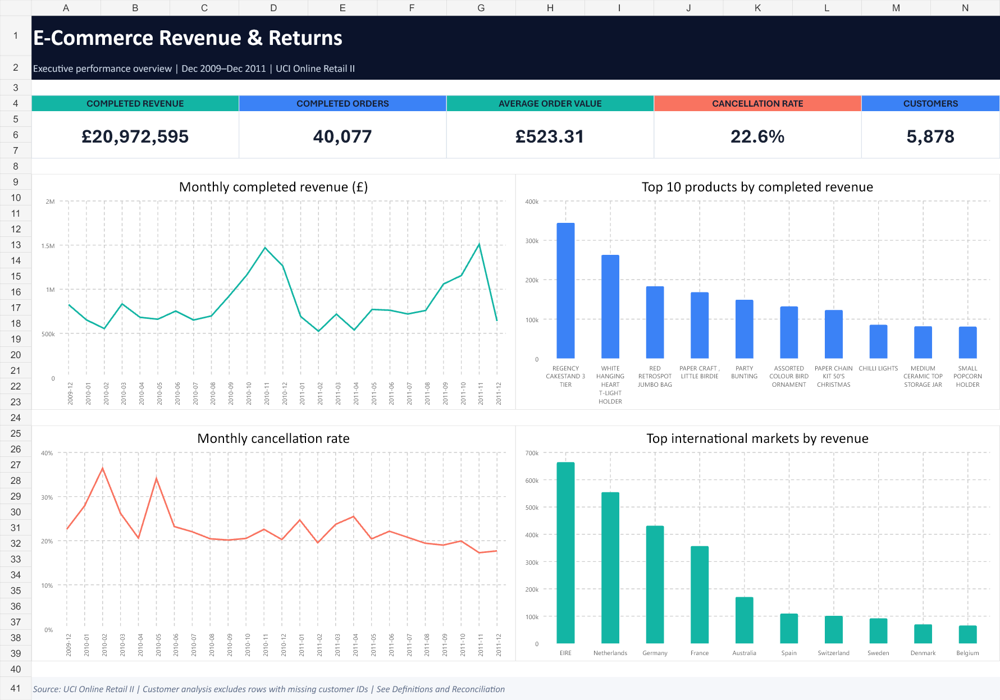
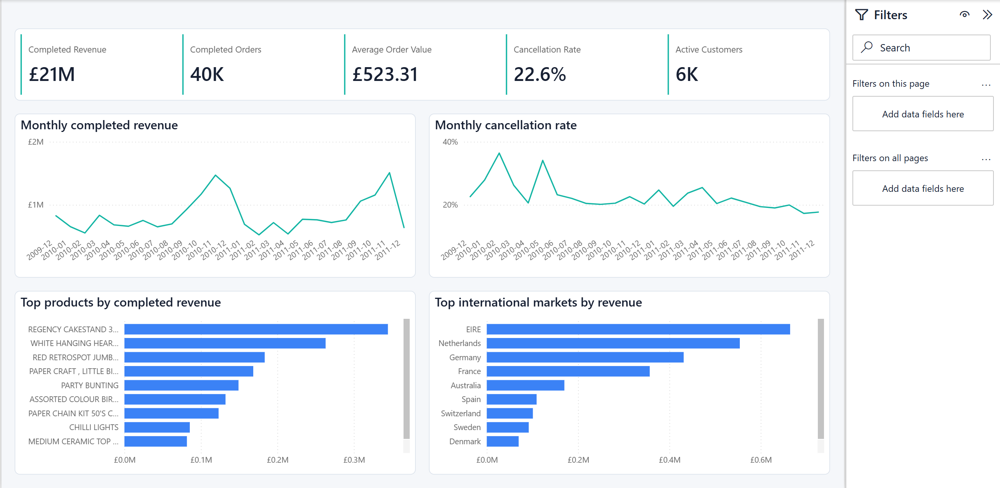
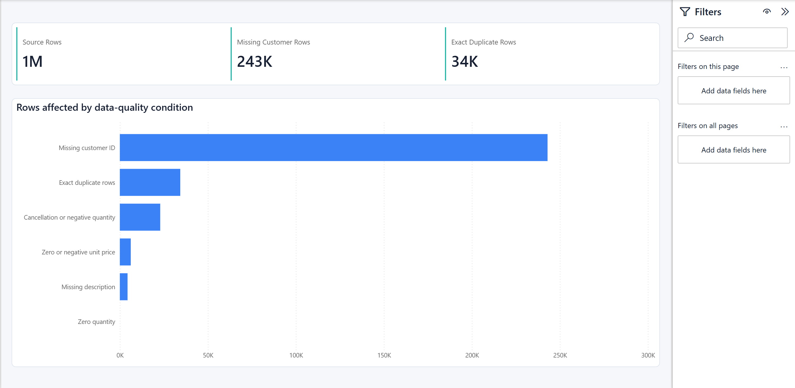

# E-Commerce Revenue & Returns Reporting

An end-to-end SQL, Excel, and Power BI reporting project built from 1,067,371
real transaction rows supplied by the UCI Machine Learning Repository.



## Power BI dashboard





## Business objective

Create a repeatable management reporting process that monitors completed
revenue, orders, average order value, cancellations, customer coverage, product
performance, international markets, and source-data quality.

## Source

- Dataset: UCI Online Retail II
- Documentation: https://archive.ics.uci.edu/dataset/502/online+retail+ii
- DOI: https://doi.org/10.24432/C5CG6D
- License: Creative Commons Attribution 4.0 International
- Coverage: December 1, 2009 through December 9, 2011

The underlying company was a UK-based non-store retailer. The source workbook
contains invoice, product, quantity, timestamp, price, customer, and country
fields. The raw workbook is not redistributed in this repository; download it
from UCI using the link above.

## Tools demonstrated

- SQL and PostgreSQL-compatible reporting views
- CTEs, window functions, conditional aggregation, and data-quality checks
- Excel formulas, reconciliation controls, tables, charts, and dashboard design
- Power BI PBIP project, TMDL semantic model, DAX measures, and PBIR report pages
- KPI definition, business reporting, and analytical communication

## Business rules

| Metric | Definition |
|---|---|
| Completed sale | Invoice does not begin with C, quantity is positive, and unit price is positive |
| Cancellation | Invoice begins with C or quantity is negative |
| Completed revenue | Quantity × unit price for completed-sale rows |
| Completed order | Distinct invoice among completed-sale rows |
| Average order value | Completed revenue divided by completed orders |
| Cancellation rate | Cancelled invoices divided by completed plus cancelled invoices |
| Active customer | Distinct nonblank customer ID with a completed sale |

## Verified results

- £20.97M completed revenue across 40,077 completed orders
- £523.31 average order value
- 11.69K cancelled orders and a 22.57% invoice cancellation rate
- November 2011 was the peak month at £1.51M completed revenue
- EIRE was the largest non-UK market at £664.43K completed revenue
- REGENCY CAKESTAND 3 TIER was the highest-revenue merchandise product at £344.56K
- 243,007 rows lacked customer IDs and 34,335 exact duplicate rows were detected

See `docs/verified_findings.md` for definitions, caveats, and interpretation.

## Deliverables

- `sql/01_schema_and_load.sql` — PostgreSQL schema, loading template, and indexes
- `sql/02_cleaning_and_quality.sql` — transaction classification and quality checks
- `sql/03_reporting_views.sql` — reusable reporting views
- `sql/04_business_analysis.sql` — management-oriented analytical queries
- [Excel dashboard](excel/Ecommerce_Revenue_Returns_Dashboard.xlsx) — executive KPI dashboard and reconciliation workbook
- [Power BI project](power-bi/EcommerceRevenueReporting/Ecommerce%20Revenue%20Reporting.pbip) — two-page PBIP report with TMDL and DAX
- [Verified findings](docs/verified_findings.md) — metric definitions, caveats, and business interpretation

## Repository structure

```text
├── sql/       PostgreSQL schema, cleaning, reporting views, and analysis
├── excel/     Formula-driven reporting workbook and dashboard
├── power-bi/  PBIP report, semantic model, DAX measures, and prepared outputs
├── images/    Portfolio-ready dashboard previews
└── docs/      Verified findings and resume-ready project summary
```

## Dashboard design

### Executive Overview

- Completed revenue
- Completed orders
- Average order value
- Cancellation rate
- Active identified customers
- Monthly completed-revenue trend
- Monthly cancellation trend
- Top products and international markets

### Data Quality

- Source rows
- Missing customer IDs
- Exact duplicate rows
- Affected rows by quality condition

## Running the SQL

1. Download the official UCI workbook.
2. Export both workbook sheets as CSV files.
3. Run the SQL scripts in numerical order.
4. Update the `\copy` paths in `01_schema_and_load.sql`.
5. Export the reporting views or connect Excel and Power BI to PostgreSQL.

## Power BI

Open `Ecommerce Revenue Reporting.pbip` in Power BI Desktop. The accompanying
semantic model imports prepared SQL-output CSV files through a `DataFolder`
parameter. If the project is moved, update that parameter to the new `data`
folder before refreshing.

## Limitations

- The source contains no product cost, margin, inventory, or marketing-spend data.
- Customer analysis excludes rows without a customer identifier.
- December 2011 is a partial month ending December 9.
- Cancellations indicate reversed transactions but do not supply a reason code.
